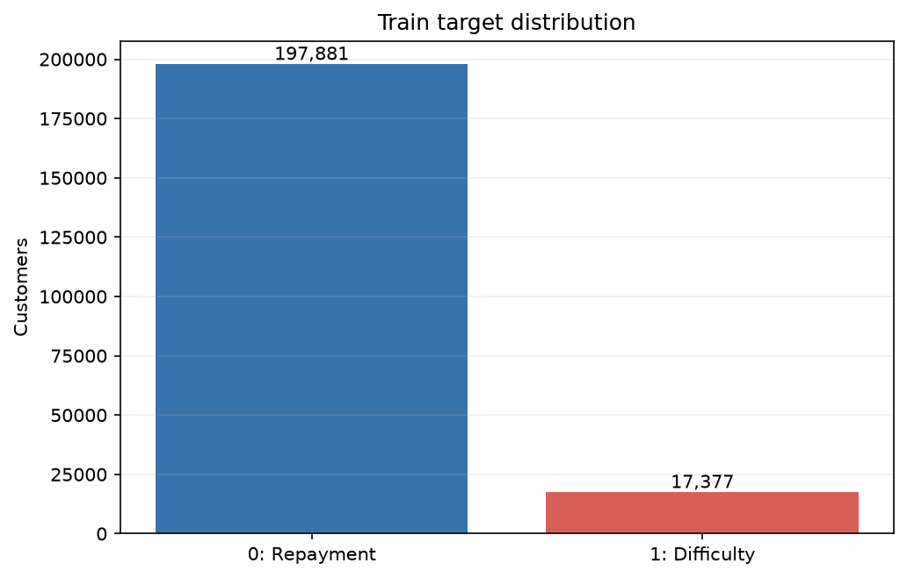
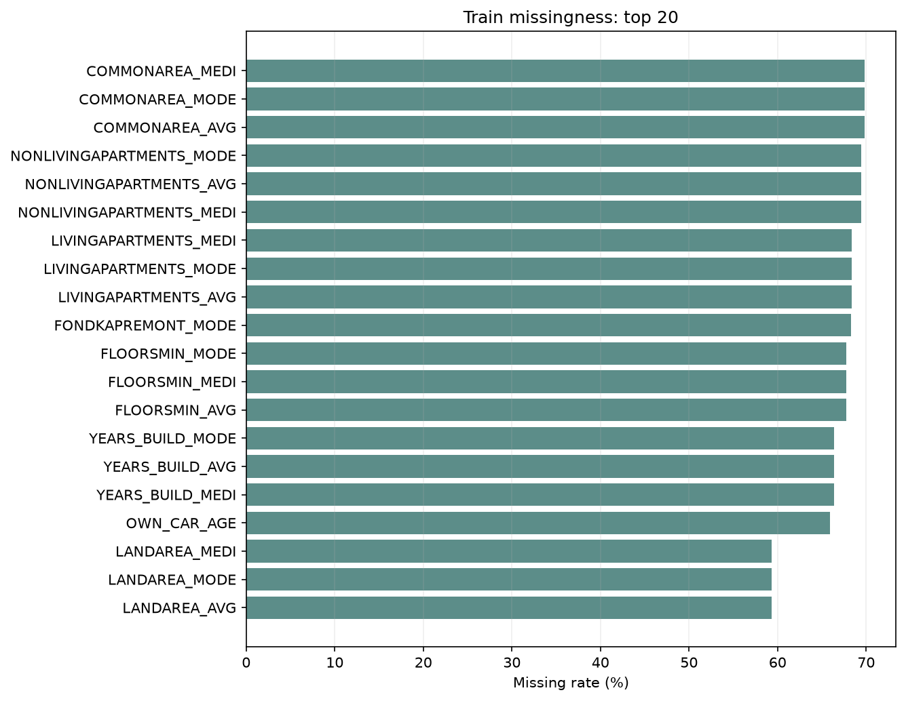
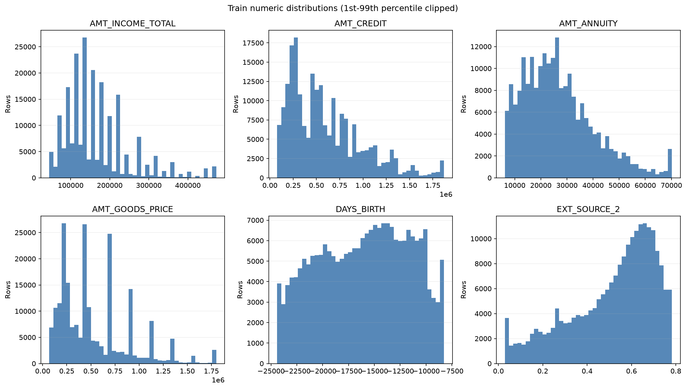

# Stage 2 학습 데이터 EDA 보고서

> 이 보고서의 모든 피처 통계와 그래프는 `train` 파티션만 사용했습니다.
> 검증 및 테스트 고객의 피처는 분석에 포함하지 않았으며 고객 식별자도 저장하지 않았습니다.

## 분석 범위

- 학습 행 수: **215,258**
- 분석 피처 수: **120**
- 수치형 / 범주형: **104 / 16**
- 결측치가 있는 피처: **67**
- 수행 범위: 분포·결측·상관·IQR 이상치와 알려진 sentinel 확인
- 제외 범위: 전처리 적용, 피처 생성, 모델 학습 및 성능 평가

## TARGET 분포

| TARGET | 고객 수 | 비율 |
|---:|---:|---:|
| 0 | 197,881 | 91.93% |
| 1 | 17,377 | 8.07% |

## 결측률 상위 피처

| 순위 | 피처 | 결측 수 | 결측률 |
|---:|---|---:|---:|
| 1 | `COMMONAREA_AVG` | 150,369 | 69.86% |
| 2 | `COMMONAREA_MEDI` | 150,369 | 69.86% |
| 3 | `COMMONAREA_MODE` | 150,369 | 69.86% |
| 4 | `NONLIVINGAPARTMENTS_AVG` | 149,432 | 69.42% |
| 5 | `NONLIVINGAPARTMENTS_MEDI` | 149,432 | 69.42% |
| 6 | `NONLIVINGAPARTMENTS_MODE` | 149,432 | 69.42% |
| 7 | `LIVINGAPARTMENTS_AVG` | 147,102 | 68.34% |
| 8 | `LIVINGAPARTMENTS_MEDI` | 147,102 | 68.34% |
| 9 | `LIVINGAPARTMENTS_MODE` | 147,102 | 68.34% |
| 10 | `FONDKAPREMONT_MODE` | 147,080 | 68.33% |
| 11 | `FLOORSMIN_AVG` | 145,926 | 67.79% |
| 12 | `FLOORSMIN_MEDI` | 145,926 | 67.79% |
| 13 | `FLOORSMIN_MODE` | 145,926 | 67.79% |
| 14 | `YEARS_BUILD_AVG` | 142,946 | 66.41% |
| 15 | `YEARS_BUILD_MEDI` | 142,946 | 66.41% |
| 16 | `YEARS_BUILD_MODE` | 142,946 | 66.41% |
| 17 | `OWN_CAR_AGE` | 141,865 | 65.90% |
| 18 | `LANDAREA_AVG` | 127,766 | 59.35% |
| 19 | `LANDAREA_MEDI` | 127,766 | 59.35% |
| 20 | `LANDAREA_MODE` | 127,766 | 59.35% |

## 수치형 분포와 이상치

수치형 피처의 평균·표준편차·사분위수와 IQR 1.5배 경계 밖의 건수를 JSON에 기록했습니다. 행을 제거하거나 값을 보정하지 않았으며, 그래프만 보기 쉽도록 1~99백분위 구간으로 표시했습니다.

## `DAYS_EMPLOYED` sentinel

- 값 `365,243` 건수: **38,564**
- 학습 고객 대비 비율: **17.92%**
- 이 값은 실제 근속일로 해석하지 않고 Stage 2 전처리 정책에서 별도 처리해야 합니다.

## 알려진 데이터 품질 확인 항목

- `CODE_GENDER=XNA`: **3건**
- `NAME_FAMILY_STATUS=Unknown`: **1건**
- 차량 보유 고객의 `OWN_CAR_AGE` 결측: **3건** (0.00%)
- 결측률 40% 이상 피처: **49개**
- 한 값이 99% 이상인 거의 상수 피처: **18개**
- 희소 범주 후보: **17개**(JSON에 최대 100개 기록)
- 위 항목은 처리 대상을 찾기 위한 관찰이며 이 보고서에서 값을 바꾸거나 행을 삭제하지 않았습니다.

## 피처와 TARGET의 관계

최소 지지 건수는 **216건**입니다. 이보다 작은 범주는 `[기타 희소 범주]`로 합쳤으며 모든 계산은 train 안에서만 수행했습니다.

### 수치형 피처

| 피처 | point-biserial 상관계수 |
|---|---:|
| `EXT_SOURCE_3` | -0.1798 |
| `EXT_SOURCE_2` | -0.1596 |
| `EXT_SOURCE_1` | -0.1531 |
| `DAYS_BIRTH` | 0.0775 |
| `REGION_RATING_CLIENT_W_CITY` | 0.0634 |
| `REGION_RATING_CLIENT` | 0.0618 |
| `DAYS_LAST_PHONE_CHANGE` | 0.0532 |
| `DAYS_ID_PUBLISH` | 0.0511 |
| `REG_CITY_NOT_WORK_CITY` | 0.0505 |
| `FLAG_DOCUMENT_3` | 0.0474 |

### 결측 여부

| 피처 | 결측 시 TARGET=1 | 관측 시 TARGET=1 | 차이 |
|---|---:|---:|---:|
| `DEF_30_CNT_SOCIAL_CIRCLE` | 3.64% | 8.09% | -4.45% |
| `DEF_60_CNT_SOCIAL_CIRCLE` | 3.64% | 8.09% | -4.45% |
| `OBS_30_CNT_SOCIAL_CIRCLE` | 3.64% | 8.09% | -4.45% |
| `OBS_60_CNT_SOCIAL_CIRCLE` | 3.64% | 8.09% | -4.45% |
| `NAME_TYPE_SUITE` | 5.41% | 8.08% | -2.68% |
| `AMT_REQ_CREDIT_BUREAU_DAY` | 10.25% | 7.73% | +2.52% |
| `AMT_REQ_CREDIT_BUREAU_HOUR` | 10.25% | 7.73% | +2.52% |
| `AMT_REQ_CREDIT_BUREAU_MON` | 10.25% | 7.73% | +2.52% |
| `AMT_REQ_CREDIT_BUREAU_QRT` | 10.25% | 7.73% | +2.52% |
| `AMT_REQ_CREDIT_BUREAU_WEEK` | 10.25% | 7.73% | +2.52% |

### 범주형 피처

| 피처 | 범주 | 건수 | TARGET=1 | 학습 전체 대비 차이 |
|---|---|---:|---:|---:|
| `OCCUPATION_TYPE` | Low-skill Laborers | 1,467 | 17.18% | +9.11% |
| `ORGANIZATION_TYPE` | Transport: type 3 | 830 | 15.90% | +7.83% |
| `ORGANIZATION_TYPE` | Culture | 258 | 3.10% | -4.97% |
| `ORGANIZATION_TYPE` | Industry: type 12 | 243 | 3.29% | -4.78% |
| `NAME_HOUSING_TYPE` | Rented apartment | 3,380 | 12.07% | +4.00% |
| `ORGANIZATION_TYPE` | Trade: type 6 | 444 | 4.50% | -3.57% |
| `ORGANIZATION_TYPE` | Construction | 4,678 | 11.61% | +3.53% |
| `NAME_HOUSING_TYPE` | With parents | 10,369 | 11.57% | +3.50% |
| `OCCUPATION_TYPE` | Drivers | 13,059 | 11.47% | +3.40% |
| `ORGANIZATION_TYPE` | Restaurant | 1,315 | 11.41% | +3.33% |

## 절댓값 상관계수 상위

train **215,258행**, 수치 피처 **72개**로 계산했습니다. 절댓값 0.95 이상인 피처 쌍은 **45개**입니다.
전체 0.95 이상 목록은 `reports/stage2_eda.json`의 `correlation.absolute_pairs_at_least_0_95`에 기록했습니다. 아래 표는 상위 10개입니다.

| 피처 A | 피처 B | Pearson 상관계수 |
|---|---|---:|
| `YEARS_BUILD_AVG` | `YEARS_BUILD_MEDI` | 0.9987 |
| `OBS_30_CNT_SOCIAL_CIRCLE` | `OBS_60_CNT_SOCIAL_CIRCLE` | 0.9984 |
| `FLOORSMIN_AVG` | `FLOORSMIN_MEDI` | 0.9972 |
| `FLOORSMAX_AVG` | `FLOORSMAX_MEDI` | 0.9971 |
| `ENTRANCES_AVG` | `ENTRANCES_MEDI` | 0.9970 |
| `ELEVATORS_AVG` | `ELEVATORS_MEDI` | 0.9961 |
| `LIVINGAREA_AVG` | `LIVINGAREA_MEDI` | 0.9956 |
| `COMMONAREA_AVG` | `COMMONAREA_MEDI` | 0.9955 |
| `BASEMENTAREA_AVG` | `BASEMENTAREA_MEDI` | 0.9955 |
| `APARTMENTS_AVG` | `APARTMENTS_MEDI` | 0.9952 |

## 해석 시 주의사항

- 상관관계는 인과관계를 뜻하지 않습니다.
- IQR 밖의 값은 검토 후보이며 자동 삭제 대상이 아닙니다.
- 검증·테스트 파티션은 전처리 정책을 확정하는 근거로 사용하지 않습니다.
- 이 단계에서는 모델을 학습하지 않았습니다.
