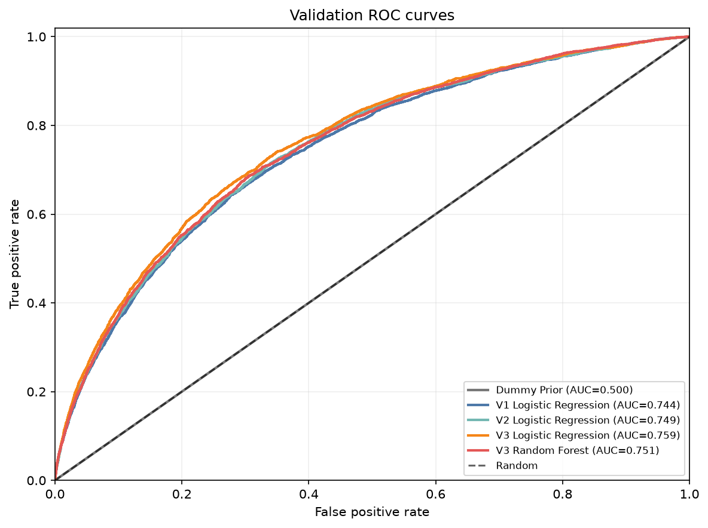
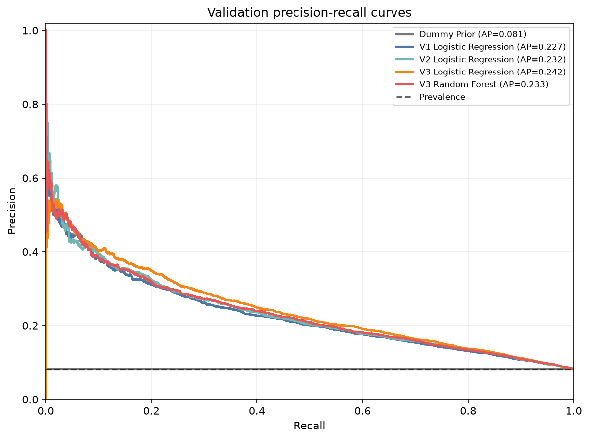
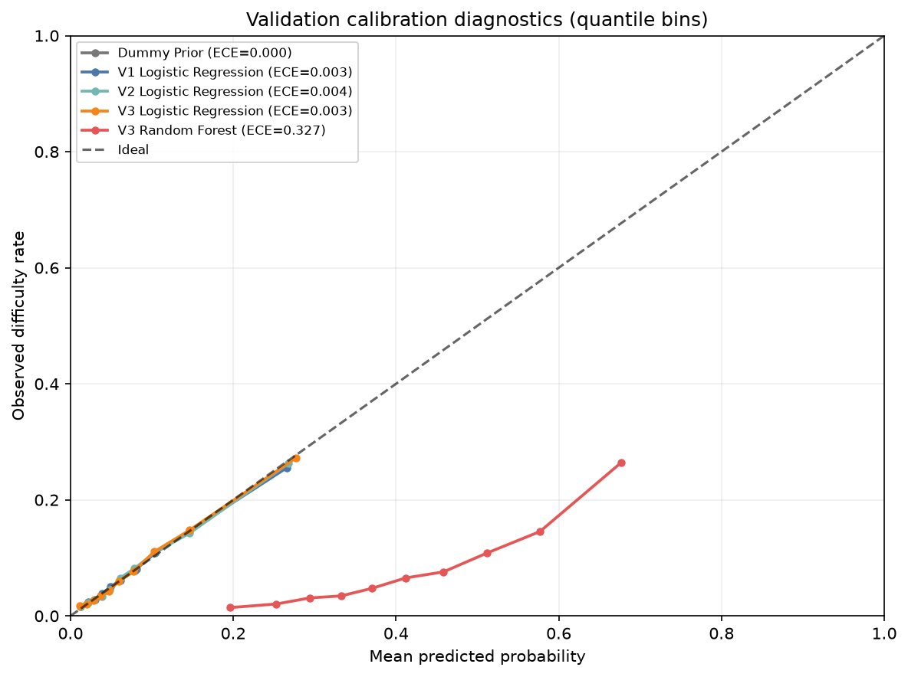
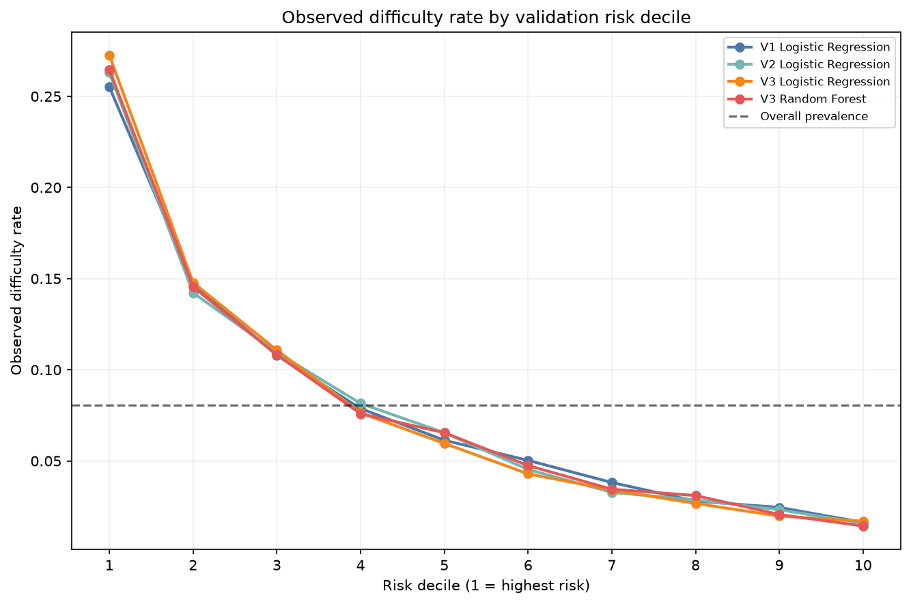
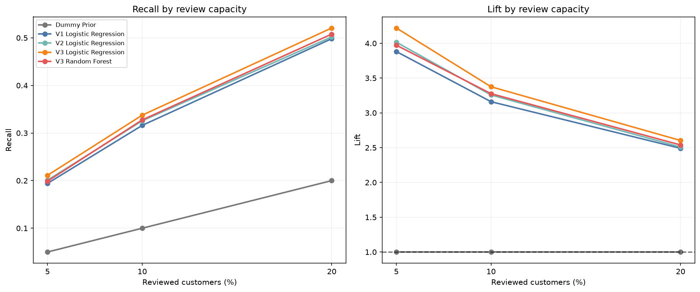

# Stage 4 Validation 상세 분석 보고서

> 기준 모델 학습에서 저장한 validation 예측점수만 사용한 진단 결과입니다. 새 모델·확률 보정기를 학습하지 않았고 test 피처·예측·평가는 사용하지 않았습니다.

## 분석 목적과 범위

- validation 고객: **46,127명**
- TARGET=1 고객: **3,724명 (8.07%)**
- 비교 모델: **5개**
- Calibration은 확률 보정 필요성을 진단한 것이며 보정기를 학습한 결과가 아닙니다.
- Top-K 경계점수는 validation 관측값이며 운영 cutoff로 확정하지 않습니다.
- 모델 차이는 같은 validation의 점추정치이며 통계적 유의성을 검정한 결론이 아닙니다.

## 핵심 결론

- 현재 Stage 4 기준선은 **V3 Logistic Regression**입니다. ROC-AUC·PR-AUC·KS가 현재 후보 중 가장 높지만 최종 모델은 아닙니다.
- V3 Logistic은 상위 10% 검토에서 위험고객의 **33.75%**를 포착했고 Lift는 **3.375**입니다.
- V3 Random Forest의 상위 10% Recall은 **32.76%**로 순위 성능은 유효하지만, 평균 점수 **40.81%**가 실제 비율 **8.07%**보다 크게 높습니다.
- Random Forest는 `balanced_subsample`을 사용했으므로 현재 점수를 실제 상환곤란 확률이나 Logistic의 같은 숫자와 직접 비교하면 안 됩니다.

## 모델별 구분력과 확률 진단

| 모델 | ROC-AUC | PR-AUC(AP) | KS | Gini | Brier | 평균 예측점수 | ECE(q10) |
|---|---:|---:|---:|---:|---:|---:|---:|
| Dummy Prior | 0.5000 | 0.0807 | 0.0000 | 0.0000 | 0.0742 | 8.07% | 0.0000 |
| V1 Logistic Regression | 0.7436 | 0.2269 | 0.3656 | 0.4871 | 0.0686 | 8.08% | 0.0027 |
| V2 Logistic Regression | 0.7490 | 0.2324 | 0.3750 | 0.4980 | 0.0684 | 8.07% | 0.0037 |
| V3 Logistic Regression | 0.7585 | 0.2424 | 0.3908 | 0.5170 | 0.0678 | 8.06% | 0.0029 |
| V3 Random Forest | 0.7507 | 0.2333 | 0.3806 | 0.5013 | 0.1820 | 40.81% | 0.3274 |

PR-AUC는 사다리꼴 면적이 아니라 Average Precision입니다. 무작위 기준선은 validation 양성 비율이며, ROC-AUC가 불균형 데이터에서 낙관적으로 보일 수 있어 PR-AUC와 Top-K를 함께 봅니다.





## Calibration 진단

같은 점수는 서로 다른 구간으로 나누지 않는 validation 10분위 진단입니다. ECE는 이 구간 정의에 의존하므로 절대적인 모델 품질 하나로 해석하지 않습니다.

| 모델 | 요청 구간 | 실제 구간 | 실제 비율 | 평균 예측점수 | 평균 편향 | ECE |
|---|---:|---:|---:|---:|---:|---:|
| Dummy Prior | 10 | 1 | 8.07% | 8.07% | -0.00% | 0.0000 |
| V1 Logistic Regression | 10 | 10 | 8.07% | 8.08% | +0.01% | 0.0027 |
| V2 Logistic Regression | 10 | 10 | 8.07% | 8.07% | -0.00% | 0.0037 |
| V3 Logistic Regression | 10 | 10 | 8.07% | 8.06% | -0.01% | 0.0029 |
| V3 Random Forest | 10 | 10 | 8.07% | 40.81% | +32.74% | 0.3274 |



## 위험도 Decile

그림은 네 기준 모델의 위험구간을 비교하고, 표는 같은 V3 데이터를 사용한 Logistic Regression과 Random Forest를 상세 비교합니다. Decile 1이 예측위험 상위 10%, Decile 10이 하위 10%입니다. 경계 동점은 분수 가중치로 배분해 행 순서가 결과를 바꾸지 않습니다.

| Decile | 고객 수 | Logistic 실제 위험률 | Logistic Lift | Logistic 누적 Recall | RF 실제 위험률 | RF Lift | RF 누적 Recall |
|---:|---:|---:|---:|---:|---:|---:|---:|
| 1 | 4,613 | 27.25% | 3.375 | 33.75% | 26.45% | 3.276 | 32.76% |
| 2 | 4,613 | 14.78% | 1.831 | 52.07% | 14.55% | 1.802 | 50.78% |
| 3 | 4,613 | 11.08% | 1.372 | 65.79% | 10.82% | 1.340 | 64.18% |
| 4 | 4,612 | 7.63% | 0.945 | 75.24% | 7.59% | 0.940 | 73.58% |
| 5 | 4,613 | 5.96% | 0.738 | 82.63% | 6.55% | 0.811 | 81.69% |
| 6 | 4,613 | 4.29% | 0.532 | 87.94% | 4.75% | 0.588 | 87.57% |
| 7 | 4,612 | 3.40% | 0.422 | 92.16% | 3.45% | 0.427 | 91.84% |
| 8 | 4,613 | 2.67% | 0.330 | 95.46% | 3.10% | 0.384 | 95.68% |
| 9 | 4,613 | 1.97% | 0.244 | 97.91% | 2.06% | 0.255 | 98.23% |
| 10 | 4,612 | 1.69% | 0.209 | 100.00% | 1.43% | 0.177 | 100.00% |

V3 Logistic의 실제 위험률은 최상위 decile **27.25%**에서 최하위 decile **1.69%**로 낮아졌습니다. 이는 점수가 위험 순위를 실질적으로 구분한다는 validation 관찰입니다.



## 우선검토 Top-K 시나리오

| 모델 | 검토 비율 | 선택 고객 | Precision | Recall | Lift |
|---|---:|---:|---:|---:|---:|
| Dummy Prior | 5% | 2,307 | 8.07% | 5.00% | 1.000 |
| Dummy Prior | 10% | 4,613 | 8.07% | 10.00% | 1.000 |
| Dummy Prior | 20% | 9,226 | 8.07% | 20.00% | 1.000 |
| V1 Logistic Regression | 5% | 2,307 | 31.34% | 19.41% | 3.882 |
| V1 Logistic Regression | 10% | 4,613 | 25.51% | 31.61% | 3.160 |
| V1 Logistic Regression | 20% | 9,226 | 20.11% | 49.81% | 2.490 |
| V2 Logistic Regression | 5% | 2,307 | 32.42% | 20.09% | 4.016 |
| V2 Logistic Regression | 10% | 4,613 | 26.30% | 32.57% | 3.257 |
| V2 Logistic Regression | 20% | 9,226 | 20.26% | 50.19% | 2.509 |
| V3 Logistic Regression | 5% | 2,307 | 34.07% | 21.11% | 4.220 |
| V3 Logistic Regression | 10% | 4,613 | 27.25% | 33.75% | 3.375 |
| V3 Logistic Regression | 20% | 9,226 | 21.02% | 52.07% | 2.603 |
| V3 Random Forest | 5% | 2,307 | 32.08% | 19.87% | 3.973 |
| V3 Random Forest | 10% | 4,613 | 26.45% | 32.76% | 3.276 |
| V3 Random Forest | 20% | 9,226 | 20.50% | 50.78% | 2.539 |

`true_positive_weight`는 경계 동점이 있을 때 분수일 수 있습니다. 이 분석은 심사 가능 인원별 비교 시나리오이며 운영 정책이나 자동 승인·거절 기준이 아닙니다.



## 데이터 사용 감사

- validation 점수 행: **46,127행**
- test 피처 사용: **0행**
- test 예측 생성: **아니요**
- 입력 산출물과 공유 JSON·Markdown에 고객 ID가 없습니다.
- 공유 JSON에는 행별 정답·예측점수와 원시 ROC·PR 좌표가 없습니다.

## Stage 4 결론과 다음 단계

V3 Logistic Regression을 Stage 5 모델 비교의 현재 기준선으로 사용합니다. 이는 최종 모델 확정이 아닙니다. Stage 5에서 LightGBM·TensorFlow MLP, train 내부 튜닝과 확률 보정 설계를 비교하고, 최종 모델과 운영 cutoff는 이후 단계에서 고정합니다. test는 Stage 8까지 봉인합니다.

재현 명령:

```bash
PYTHONPATH=src .venv/bin/python -m creditlens.analysis.stage4_validation_analysis
```
