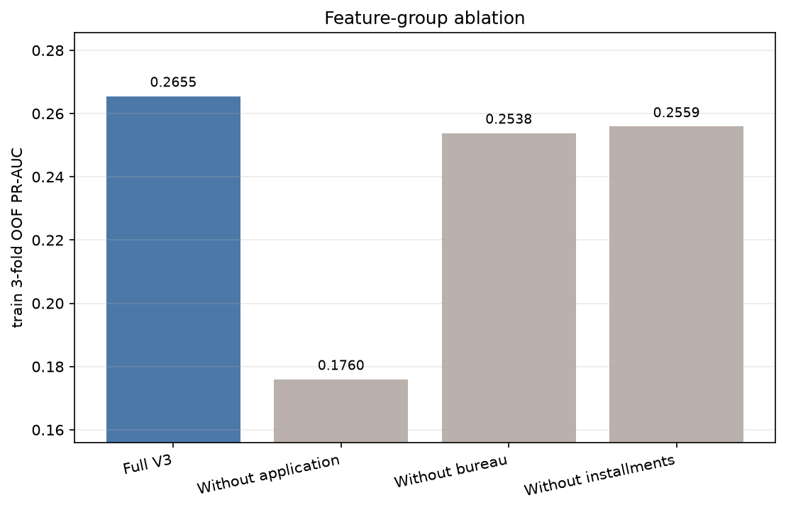
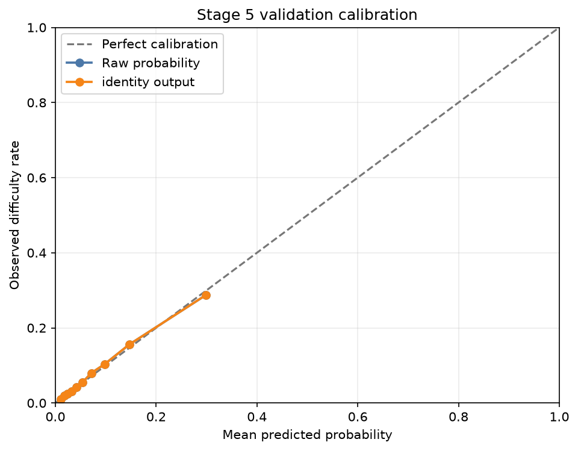

# Stage 5 3/3 제한 개선·확률 보정·피처군 분석 보고서

> Stage 4·5의 이전 validation 비교 결과는 이미 존재합니다. 이번 3/3 실행에서는 모든 설정 선택과 확률 보정 학습을 train 내부에서 끝낸 뒤 현재 validation 피처·TARGET을 처음 로드해 base model 예측을 한 번 수행했습니다. test는 사용하지 않았습니다.

## 왜 이 단계를 했는가

튜닝 전 비교에서 V3 LightGBM이 가장 높았지만, 우연한 설정 하나만 보고 후보를 고정할 수는 없습니다. 그래서 작은 후보군만 train 내부 교차검증으로 비교하고, 각 정보 원천을 하나씩 제거해 예측 신호와의 연관성을 확인했습니다. 위험 순서뿐 아니라 점수를 확률로 해석할 수 있도록 보정 방법도 train 내부에서 선택했습니다.

## 피처군 계약

| 피처군 | 정의 | 피처 수 | 순서 포함 SHA-256 |
|---|---|---:|---|
| 신청정보 | V1 전체 모델 피처 | 132 | `45bf05c4f95064e87a68bd9d572009b89a4fde0a389440f8eec3ff30312c1281` |
| 외부 신용이력 | V2 − V1 스키마 차집합 | 37 | `2db90e91bcf3e9b8eba962df59ad9213efe5e395ef43b1c4d2d0013286f8526e` |
| 납부이력 | V3 − V2 스키마 차집합 | 29 | `6c5895e00d652c85265908332227c7f535f3a692b166690dd9b437e9eda95ead` |

세 그룹은 서로 겹치지 않고 합치면 V3 모델 피처 198개가 됩니다. 해시는 V3 역할 순서대로 정렬된 컬럼명을 UTF-8로 인코딩하고 줄바꿈으로 연결하되 마지막 줄바꿈은 넣지 않아 계산했습니다.

## 제한 튜닝: train 3-fold 결과

| 후보 | 평균 ROC-AUC | 평균 PR-AUC | 평균 Recall@10% | 선택 |
|---|---:|---:|---:|---|
| 기존 고정 설정 | 0.7724 | 0.2613 | 0.3535 | - |
| 규제·행/열 표본추출 | 0.7746 | 0.2633 | 0.3533 | 채택 |
| 용량 확대·강한 규제 | 0.7723 | 0.2615 | 0.3537 | - |

선택 결과는 **규제·행/열 표본추출**입니다. 보수적 개선 기준을 통과한 후보 중 최고 PR-AUC와 실질적 동률인 가장 단순한 설정.

후보를 바꾸려면 기준 설정보다 평균 PR-AUC가 0.001 이상 높고, 3개 중 2개 이상의 fold에서 우세하며, ROC-AUC와 Recall@10% 보호 기준도 통과해야 했습니다.
최고 후보 간 PR-AUC 차이가 0.0005 이내면 더 단순한 설정을 선택했습니다. 아래 내부 수치는 후보 선택용 개발 추정치이며 외부 성능의 비편향 추정치로 해석하지 않습니다.

## 피처군 ablation: train OOF 결과

| 입력 | 피처 수 | ROC-AUC | PR-AUC | Recall@10% | full−제외 ΔPR-AUC |
|---|---:|---:|---:|---:|---:|
| 전체 V3 | 198 | 0.7747 | 0.2655 | 0.3574 | - |
| 신청정보 제외 | 66 | 0.6843 | 0.1760 | 0.2601 | +0.0895 |
| 외부 신용이력 제외 | 161 | 0.7688 | 0.2538 | 0.3462 | +0.0117 |
| 납부이력 제외 | 169 | 0.7659 | 0.2559 | 0.3467 | +0.0096 |

`full - 제외 모델`의 양수 차이는 해당 정보 원천을 포함한 모델이 train 내부에서 더 높았다는 뜻입니다. 튜닝과 다른 fold 배치를 사용했지만 같은 train에서 선택된 설정을 이용한 탐색적 연관성 분석이므로 인과효과나 외부 검증 결과로 해석하지 않습니다.

## 확률 보정: train OOF 안의 5-fold 교차적합

| 방법 | Brier | Log loss | ECE | 선택 |
|---|---:|---:|---:|---|
| identity | 0.066767 | 0.241073 | 0.003974 | 채택 |
| sigmoid | 0.066743 | 0.241008 | 0.002792 | - |
| isotonic | 0.066761 | 0.241183 | 0.000698 | - |

보정 선택은 **identity**입니다. 보정 후보가 보수적 개선 기준을 통과하지 못해 원 점수 유지.
identity는 점수를 바꾸지 않는 방법이므로 원 확률과 선택 변환 후 결과가 같습니다.
이 비교는 base OOF 점수 위에서 보정기만 교차적합한 train 내부 선택용 추정치이며 완전한 nested CV 결과는 아닙니다. 위험순위에는 보정 전 raw 점수를 계속 사용합니다.

## 잠금 뒤 공식 validation 결과

| 출력 | ROC-AUC | PR-AUC | KS | Brier | Recall@10% | Lift@10% |
|---|---:|---:|---:|---:|---:|---:|
| 원 LightGBM 확률 | 0.7765 | 0.2699 | 0.4174 | 0.0665 | 0.3561 | 3.5605 |
| 선택 변환 후(identity: 원 확률 유지) | 0.7765 | 0.2699 | 0.4174 | 0.0665 | 0.3561 | 3.5605 |

## 전체 V3 모델 비교

| 모델·출력 | ROC-AUC | PR-AUC | KS | Brier | Recall@10% |
|---|---:|---:|---:|---:|---:|
| V3 Logistic Regression | 0.7585 | 0.2424 | 0.3908 | 0.0678 | 0.3375 |
| V3 Random Forest | 0.7507 | 0.2333 | 0.3806 | 비교 제외 | 0.3276 |
| V3 LightGBM | 0.7752 | 0.2665 | 0.4181 | 0.0667 | 0.3596 |
| V3 TensorFlow MLP | 0.7602 | 0.2437 | 0.3917 | 비교 제외 | 0.3405 |
| Stage 5 선택 V3 LightGBM (원 확률) | 0.7765 | 0.2699 | 0.4174 | 0.0665 | 0.3561 |
| Stage 5 선택 V3 LightGBM (identity 보정) | 0.7765 | 0.2699 | 0.4174 | 0.0665 | 0.3561 |

Random Forest와 MLP는 class weight를 사용한 미보정 점수이므로 Brier를 다른 비가중 모델과 직접 비교하지 않습니다. 확률 보정은 순위 성능을 높이는 작업이 아니므로 모델 순위는 raw score의 PR-AUC·ROC-AUC·KS·Top-K로 비교합니다.

## Stage 6 전달 후보

- 기반 모델: V3 LightGBM (규제·행/열 표본추출)
- 확률 변환: identity
- 선정 근거: 기존 고정 비교에서 V3 LightGBM이 가장 높은 순위 성능을 보였고, 3/3에서는 공식 validation을 사용하지 않은 train 내부 규칙으로 설정과 확률 보정 방법을 고정함
- 용도: 자동 승인·거절이 아니라 위험순위와 우선검토를 돕는 분석 후보
- 상태: validation 기반 개발 후보이며 봉인 test의 최종 평가는 아직 수행하지 않음

## 누수·데이터 사용 감사

- train: 215,258명
- validation: 46,127명
- 공식 validation base-model 예측 호출: 1회
- 이번 실행의 validation 피처·TARGET은 설정 잠금 파일 저장 뒤 처음 로드
- Stage 4·5의 이전 validation 비교 결과는 참조값으로만 사용
- test 피처 사용: 0행
- fold마다 전처리를 해당 fit 부분에만 학습
- 튜닝·ablation·보정 방법 선택에 공식 validation을 사용하지 않음
- 공유 결과에 고객 ID·행별 정답·행별 점수를 저장하지 않음
