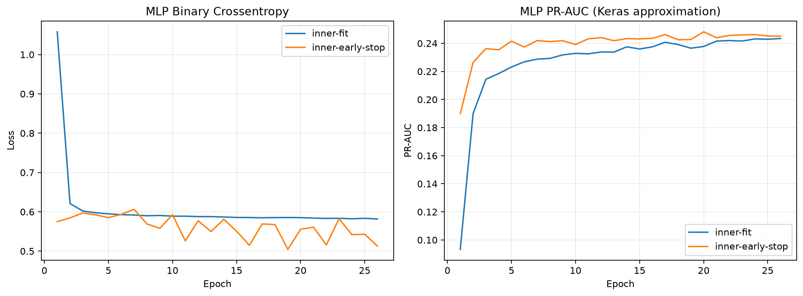

# Stage 5 2/3 TensorFlow MLP 보고서

> V3 공식 train 내부에서 early stopping epoch를 정한 뒤 새 MLP를 train 전체로 재학습하고 공식 validation에서 한 번 비교한 결과입니다. test는 사용하지 않았습니다.
>
> 이 문서는 Stage 5 2/3 당시의 비교 기록입니다. 전체 후보 비교와 후속 선정 결과는 [Stage 5 3/3 보고서](Stage5_Final_Model_Selection_Report.md)에 정리했습니다.

## 왜 MLP를 비교했는가

LightGBM은 트리를 순차적으로 결합하고 MLP는 여러 신경망 층을 통해 피처 조합을 학습합니다. 같은 V3 데이터에서 MLP를 비교해 딥러닝의 추가 복잡도와 계산비용이 실제 성능 향상으로 이어지는지 확인했습니다.

## 누수 방지 학습 흐름

1. 공식 train을 90% inner-fit과 10% inner-early-stop으로 층화 분리했습니다.
2. 발견 단계 전처리는 inner-fit에만 fit하고 inner-early-stop은 학습 중단 epoch 선택에만 사용했습니다.
3. best epoch를 고정한 뒤 발견 모델을 버리고, 새 전처리기와 새 MLP를 공식 train 전체로 해당 epoch만큼 재학습했습니다.
4. 공식 validation은 full-train refit에 전달하지 않고 마지막 예측 한 번에만 사용했습니다.
5. test 피처·예측·평가는 사용하지 않았습니다.

## Early stopping 결과

- 실행 epoch: 26
- 선택한 best epoch: 20
- best inner PR-AUC 근사값: 0.2482
- inner-fit 고객: 193,732명
- inner-early-stop 고객: 21,526명

Keras PR-AUC는 epoch 선택용 threshold 근사치입니다. 아래 공식 비교 수치는 프로젝트 공통 평가 함수의 Average Precision으로 다시 계산했습니다.

## 공식 validation 결과

| 모델 | ROC-AUC | PR-AUC(AP) | KS | Gini | Brier(진단) | Recall@10% | Lift@10% |
|---|---:|---:|---:|---:|---:|---:|---:|
| V3 TensorFlow MLP | 0.7602 | 0.2437 | 0.3917 | 0.5203 | 0.2034 | 0.3405 | 3.4047 |

상환곤란 고객이 적어 학습 시 class weight를 사용했습니다. 따라서 sigmoid 출력은 아직 보정된 실제 확률이 아니며 Brier와 0.5 threshold 결과는 보정 전 진단값입니다. 비가중 Logistic·LightGBM과 Brier를 직접 비교하지 않습니다.

## 기존 V3 모델과의 순위 성능 비교

| 비교 | Δ ROC-AUC | Δ PR-AUC | Δ KS | Δ Recall@10% |
|---|---:|---:|---:|---:|
| MLP - Logistic | +0.0017 | +0.0013 | +0.0010 | +0.0030 |
| MLP - Random Forest | +0.0095 | +0.0104 | +0.0111 | +0.0129 |
| MLP - LightGBM | -0.0150 | -0.0228 | -0.0264 | -0.0191 |

## 현재 해석

- V3 MLP의 ROC-AUC/PR-AUC는 0.7602/0.2437입니다.
- 현재 고정 설정 V3 LightGBM은 0.7752/0.2665입니다.
- 이 결과는 2/3 시점에 MLP 고정 비교 후보를 추가한 것이며, 이 결과만으로 Stage 5 후보를 선정하지 않았습니다.
- validation 결과를 보고 MLP 구조, class weight 또는 epoch를 다시 바꾸지 않았습니다. 제한 개선과 확률 보정은 Stage 5 3/3에서 train 내부 데이터로만 수행했습니다.

## 실행 환경과 산출물 감사

- TensorFlow/Keras: 2.21.0 / 3.15.1
- CPU thread: intra 2, inter 1
- 입력 피처 198개 → 전처리 후 420개, 학습 파라미터 62,209개
- train 고객: 215,258명
- validation 고객: 46,127명
- 전체 실행시간: 125.7초
- 프로세스 최대 RSS: 약 3,615.8MB
- train/validation dense float32 행렬: 약 344.9MiB / 73.9MiB
- test 피처 사용: 0행
- 모델·전처리·행별 점수는 models/stage5에 저장하고 Git에서 제외했습니다.
- 공유 JSON·Markdown에는 고객 ID와 행별 점수를 포함하지 않았습니다.

## 후속 결과

Stage 5 3/3에서 train 내부 제한 튜닝·확률 보정·피처군 분석과 전체 후보 비교를 완료했습니다. 선정 결과는 [Stage 5 3/3 보고서](Stage5_Final_Model_Selection_Report.md)에서 확인할 수 있으며, test는 계속 봉인했습니다.
