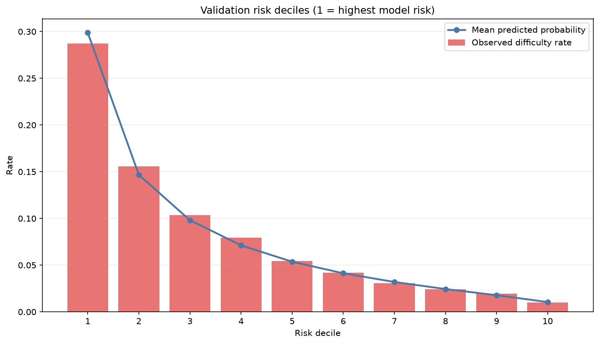
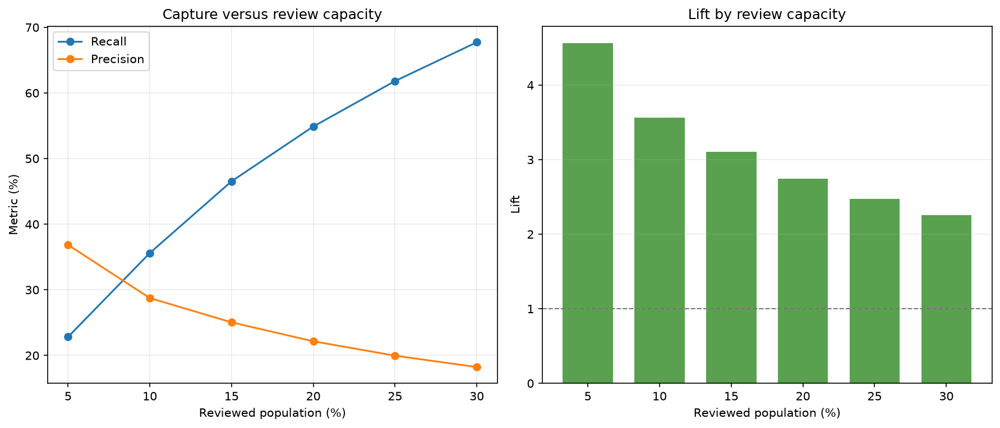
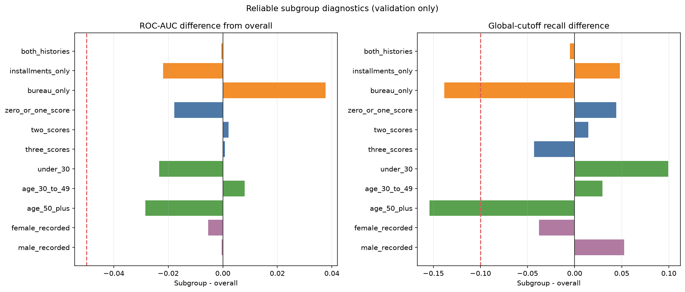

# Stage 6 2/3 위험전략·하위그룹 분석 보고서

> Stage 5에서 고정한 V3 LightGBM을 다시 학습하지 않고 validation에서 위험구간, 심사 용량과 하위그룹을 분석했습니다. test는 사용하지 않았습니다.

## 왜 이 분석을 했는가

전체 ROC-AUC와 PR-AUC만으로는 실제 검토 인원에 따라 위험고객을 얼마나 찾는지, 점수 구간이 실제 위험률을 구분하는지, 정보가 부족한 고객이나 주요 하위그룹에서 성능이 달라지는지 알 수 없습니다. 따라서 하나의 점수를 업무 참고 정보로 쓰기 전에 용량·구간·하위그룹별 한계를 validation에서 확인했습니다.

## 분석 계약

- 분석 데이터: validation 46,127명
- 모델·전처리 재학습 또는 변경: 없음
- 고위험 잠정 구간: validation 위험점수 상위 10% 경계 이상
- 중위험 잠정 구간: 상위 10% 다음부터 누적 상위 30% 경계 이상
- 하위그룹별 별도 cutoff 사용: 금지
- test 피처·예측 사용: 0행

## 고정 모델 재현 확인

- ROC-AUC / PR-AUC: `0.7765` / `0.2699`
- 저장 점수와 현재 예측 최대 차이: `0.0000000298`
- 선택된 확률 보정: `identity`

## 위험구간

아래 구간은 Stage 6 3/3에서 잠그기 전의 잠정 기준입니다. 실제 상환곤란 비율이 고위험→중위험→저위험 순으로 낮아지는지를 확인합니다.

| 구간 | 고객 수 | 인구 비중 | 평균 예측확률 | 실제 상환곤란 비율 | 전체 위험고객 중 포함 비중 | Lift |
|---|---:|---:|---:|---:|---:|---:|
| 고위험 | 4,613 | 10.00% | 29.88% | 28.74% | 35.61% | 3.56 |
| 중위험 | 9,226 | 20.00% | 12.24% | 12.96% | 32.12% | 1.61 |
| 저위험 | 32,288 | 70.00% | 3.59% | 3.72% | 32.28% | 0.46 |

- 고위험/저위험 실제 위험률 배수: `7.72`배
- 실제 위험률 순서 단조성: `PASS`

### 위험도 decile

| Decile | 고객 수 | 평균 예측확률 | 실제 상환곤란 비율 | Lift | 누적 Recall |
|---:|---:|---:|---:|---:|---:|
| 1 | 4,613 | 29.88% | 28.74% | 3.56 | 35.61% |
| 2 | 4,613 | 14.67% | 15.56% | 1.93 | 54.89% |
| 3 | 4,613 | 9.81% | 10.36% | 1.28 | 67.72% |
| 4 | 4,612 | 7.13% | 7.96% | 0.99 | 77.58% |
| 5 | 4,613 | 5.37% | 5.44% | 0.67 | 84.32% |
| 6 | 4,613 | 4.13% | 4.21% | 0.52 | 89.53% |
| 7 | 4,612 | 3.20% | 3.08% | 0.38 | 93.34% |
| 8 | 4,613 | 2.44% | 2.41% | 0.30 | 96.32% |
| 9 | 4,613 | 1.78% | 1.95% | 0.24 | 98.74% |
| 10 | 4,612 | 1.05% | 1.02% | 0.13 | 100.00% |

## 심사 용량별 Top-K 시나리오

Top-K는 점수가 높은 순서로 정해진 수만큼 검토한다고 가정한 분석입니다. 검토 범위를 넓히면 Recall은 늘지만 Precision과 Lift는 낮아지는 것이 일반적인 교환관계입니다.

| 검토 비중 | 검토 인원 | cutoff | 포착 위험고객 | Recall | Precision | Lift | 추가 구간 Precision |
|---:|---:|---:|---:|---:|---:|---:|---:|
| 5% | 2,307 | 0.264050 | 850 | 22.82% | 36.84% | 4.56 | 36.84% |
| 10% | 4,613 | 0.186077 | 1326 | 35.61% | 28.74% | 3.56 | 20.64% |
| 15% | 6,920 | 0.145117 | 1733 | 46.54% | 25.04% | 3.10 | 17.64% |
| 20% | 9,226 | 0.116929 | 2044 | 54.89% | 22.15% | 2.74 | 13.49% |
| 25% | 11,532 | 0.097201 | 2302 | 61.82% | 19.96% | 2.47 | 11.19% |
| 30% | 13,839 | 0.082518 | 2522 | 67.72% | 18.22% | 2.26 | 9.54% |

기존 핵심 평가 기준인 Top 10%는 이번 단계에서도 비교 기준으로 유지하지만 아직 운영 cutoff로 확정하지 않습니다.

## 하위그룹 진단

하위그룹에는 전체와 같은 고위험 cutoff를 적용했습니다. 표본 1,000명·양성 50명·음성 50명 이상인 그룹만 자동 경고 판단에 사용하고, 20명 미만 그룹은 세부 지표를 공개하지 않았습니다.

### 금융이력 가용성

| 그룹 | 고객 수 | 위험률 | ROC-AUC | PR-AUC | Brier | 확률편향 | cutoff Recall | 선택률 | 상태 |
|---|---:|---:|---:|---:|---:|---:|---:|---:|---|
| 외부 신용·납부이력 모두 있음 | 37,517 | 7.89% | 0.7760 | 0.2701 | 0.0650 | -0.11%p | 35.11% | 9.61% | 경고 판단 가능 |
| 납부이력만 있음 | 6,195 | 10.35% | 0.7546 | 0.2832 | 0.0840 | -0.48%p | 40.41% | 14.22% | 경고 판단 가능 |
| 외부 신용이력만 있음 | 2,059 | 4.91% | 0.8141 | 0.1885 | 0.0433 | 0.71%p | 21.78% | 5.20% | 경고 판단 가능 |
| 두 이력 모두 관측되지 않음 | 356 | 6.46% | 0.8263 | 0.2981 | 0.0530 | -0.10%p | 26.09% | 5.34% | 탐색적 소표본 |

### 외부 신용평가값 가용성

| 그룹 | 고객 수 | 위험률 | ROC-AUC | PR-AUC | Brier | 확률편향 | cutoff Recall | 선택률 | 상태 |
|---|---:|---:|---:|---:|---:|---:|---:|---:|---|
| 외부 신용평가값 0~1개 관측 | 5,513 | 9.65% | 0.7587 | 0.2735 | 0.0791 | 0.14%p | 40.04% | 13.95% | 경고 판단 가능 |
| 외부 신용평가값 2개 관측 | 24,211 | 8.18% | 0.7786 | 0.2862 | 0.0668 | -0.11%p | 37.05% | 10.22% | 경고 판단 가능 |
| 외부 신용평가값 3개 관측 | 16,403 | 7.38% | 0.7772 | 0.2445 | 0.0620 | -0.25%p | 31.30% | 8.35% | 경고 판단 가능 |

### 연령대

| 그룹 | 고객 수 | 위험률 | ROC-AUC | PR-AUC | Brier | 확률편향 | cutoff Recall | 선택률 | 상태 |
|---|---:|---:|---:|---:|---:|---:|---:|---:|---|
| 30세 미만 | 6,735 | 11.02% | 0.7532 | 0.2999 | 0.0882 | 0.27%p | 45.55% | 18.08% | 경고 판단 가능 |
| 30~49세 | 23,720 | 8.85% | 0.7845 | 0.2945 | 0.0714 | -0.37%p | 38.57% | 11.39% | 경고 판단 가능 |
| 50세 이상 | 15,672 | 5.63% | 0.7481 | 0.1818 | 0.0498 | 0.07%p | 20.18% | 4.43% | 경고 판단 가능 |

### 성별 기록 감사

| 그룹 | 고객 수 | 위험률 | ROC-AUC | PR-AUC | Brier | 확률편향 | cutoff Recall | 선택률 | 상태 |
|---|---:|---:|---:|---:|---:|---:|---:|---:|---|
| 여성으로 기록 | 30,513 | 7.11% | 0.7711 | 0.2435 | 0.0599 | 0.12%p | 31.83% | 8.22% | 경고 판단 가능 |
| 남성으로 기록 | 15,613 | 9.97% | 0.7761 | 0.3073 | 0.0795 | -0.62%p | 40.87% | 13.48% | 경고 판단 가능 |
| 기타·미상 기록 | 1 | 비공개 | 비공개 | 비공개 | 비공개 | 비공개 | 비공개 | 비공개 | 소표본 억제 |

- 신뢰 가능한 그룹에서 발생한 진단 경고 수: `3`건
- 경고는 개선 검토 신호이며 차별이나 인과관계를 확정하는 판정이 아닙니다.
- 성별 기록은 모델 피처에서 제외됐고, 여기서는 집계 감사에만 사용했습니다.
- 그룹마다 위험률이 다르므로 PR-AUC·Brier·선택률을 단순 숫자 하나로만 비교하지 않습니다.
- 하위그룹별 별도 cutoff는 만들지 않습니다.

### 진단 경고 상세

- **금융이력 가용성 · 외부 신용이력만 있음:** 공통 cutoff Recall `21.78%` vs 전체 `35.61%` (차이 `-13.82%p`)
- **연령대 · 30세 미만:** Brier `0.0882` vs 전체 `0.0665` (차이 `+0.0216`)
- **연령대 · 50세 이상:** 공통 cutoff Recall `20.18%` vs 전체 `35.61%` (차이 `-15.43%p`)

Brier는 그룹의 원래 위험률에도 영향을 받으므로, Brier 경고 하나만으로 모델이 그 그룹에서 나쁘다고 단정하지 않습니다. Recall 경고도 전체 공통 cutoff에서의 선택률 차이와 함께 해석합니다.

## Stage 6 3/3로 넘기는 판단 자료

- 위험구간 순서: `PASS`
- 신뢰 가능한 하위그룹 경고: `3`건
- Top 10%는 현재 비교 기준일 뿐 최종 cutoff가 아닙니다.
- 다음 단계에서 경고 내용을 검토하고 개선 여부를 판단한 뒤 모델·보정기·위험구간·cutoff·checksum과 사용 한계를 고정합니다.
- test는 Stage 8에서 고정된 산출물에 한 번만 사용하며, 그 결과로 모델을 다시 조정하지 않습니다.

## 해석 한계

- 모든 결과는 해외 과거 공개 데이터의 validation 분석이며 국내 실제 금융환경을 대표하지 않습니다.
- 점수구간과 하위그룹 차이는 연관성 진단이며 개인의 원인이나 집단의 본질적 특성을 뜻하지 않습니다.
- 이 결과만으로 대출을 자동 승인·거절하거나 공식 신용등급을 만들 수 없습니다.
