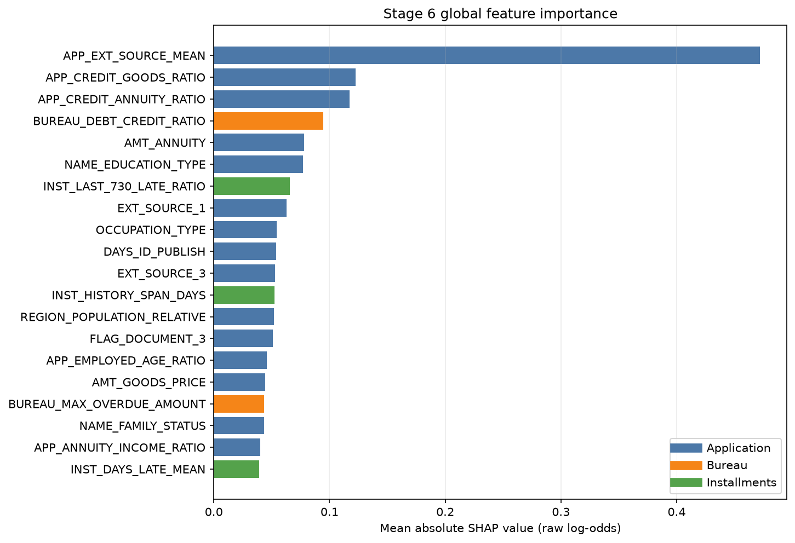
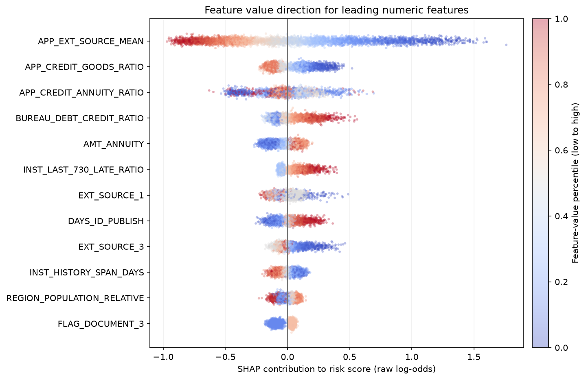
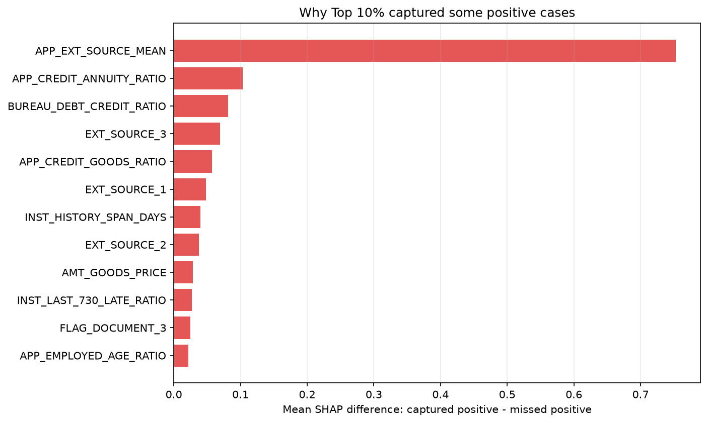

# Stage 6 1/3 SHAP·오류 분석 보고서

> Stage 5에서 선택한 V3 LightGBM을 변경하거나 다시 학습하지 않고 validation에서 해석했습니다. test는 사용하지 않았으며, 고객별 상세 설명은 Git 제외 로컬 파일에만 저장했습니다.

## 왜 이 분석을 했는가

ROC-AUC와 PR-AUC는 모델이 얼마나 잘 구분하는지는 알려주지만 어떤 정보 때문에 점수가 달라졌는지는 알려주지 않습니다. SHAP으로 각 피처가 모델의 위험점수를 올리거나 낮춘 정도를 계산해 모델이 합리적인 신호를 사용하는지 확인하고, Top 10% 우선검토에서 포착한 상환곤란 고객과 놓친 고객의 차이를 진단했습니다.

## 분석 계약

- 분석 데이터: validation 46,127명
- SHAP 계산 행: 46,127명(전체 validation)
- 원본 피처 198개 → 전처리 후 420개 → 원본 피처 단위로 재집계
- 알고리즘: LightGBM Tree SHAP, 모델 내부 raw log-odds 출력
- 양수 SHAP: 해당 피처가 모델 위험점수를 높인 방향, 음수 SHAP: 낮춘 방향
- SHAP은 모델 내부 연관성을 설명하며 원인·인과관계를 증명하지 않음
- test 피처 사용: 0행

## Stage 5 모델 재현 확인

- Stage 5 저장 점수와 현재 모델 점수 최대 차이: `0.0000000298`
- SHAP 합과 LightGBM raw log-odds 최대 차이: `0.0000001135`
- 현재 validation ROC-AUC / PR-AUC: `0.7765` / `0.2699`

## 전역 SHAP 중요도

| 순위 | 원본 피처 | 정보 원천 | 평균 |SHAP| | 중요도 비중 | 평균 방향 |
|---:|---|---|---:|---:|---:|
| 1 | `APP_EXT_SOURCE_MEAN` (외부 신용평가값 평균) | 신청정보 | 0.471807 | 14.64% | 0.009405 |
| 2 | `APP_CREDIT_GOODS_RATIO` | 신청정보 | 0.122637 | 3.81% | -0.002100 |
| 3 | `APP_CREDIT_ANNUITY_RATIO` (연간 상환액 대비 대출금액) | 신청정보 | 0.117265 | 3.64% | 0.000004 |
| 4 | `BUREAU_DEBT_CREDIT_RATIO` | 외부 신용이력 | 0.094599 | 2.94% | -0.004602 |
| 5 | `AMT_ANNUITY` (연간 상환액) | 신청정보 | 0.077794 | 2.41% | -0.001422 |
| 6 | `NAME_EDUCATION_TYPE` (교육 수준) | 신청정보 | 0.076976 | 2.39% | -0.000313 |
| 7 | `INST_LAST_730_LATE_RATIO` | 과거 납부이력 | 0.065836 | 2.04% | 0.000795 |
| 8 | `EXT_SOURCE_1` (외부 신용평가값 1) | 신청정보 | 0.062685 | 1.95% | -0.002007 |
| 9 | `OCCUPATION_TYPE` (직업 유형) | 신청정보 | 0.054249 | 1.68% | -0.000644 |
| 10 | `DAYS_ID_PUBLISH` | 신청정보 | 0.053653 | 1.66% | -0.001206 |
| 11 | `EXT_SOURCE_3` (외부 신용평가값 3) | 신청정보 | 0.052998 | 1.64% | -0.004454 |
| 12 | `INST_HISTORY_SPAN_DAYS` | 과거 납부이력 | 0.052359 | 1.62% | -0.003823 |
| 13 | `REGION_POPULATION_RELATIVE` | 신청정보 | 0.051958 | 1.61% | -0.000463 |
| 14 | `FLAG_DOCUMENT_3` | 신청정보 | 0.050803 | 1.58% | -0.000610 |
| 15 | `APP_EMPLOYED_AGE_RATIO` | 신청정보 | 0.045789 | 1.42% | 0.000210 |

평균 `|SHAP|`은 영향의 크기이고 평균 방향은 전체 고객에서 양·음 기여가 상쇄될 수 있으므로 중요도와 같은 뜻이 아닙니다. 상관된 피처들은 중요도를 나눠 가질 수 있습니다.

### 정보 원천별 SHAP 비중

| 정보 원천 | 피처 수 | SHAP 비중 |
|---|---:|---:|
| 신청정보 | 132 | 69.20% |
| 외부 신용이력 | 37 | 14.32% |
| 과거 납부이력 | 29 | 16.48% |

## 주요 수치형 피처의 방향

점 하나는 validation 고객 한 명이며 색은 해당 피처값의 낮음→높음 순위입니다. 오른쪽은 위험점수를 높인 기여, 왼쪽은 낮춘 기여입니다. 비선형 모델이므로 한 피처가 모든 구간에서 같은 방향으로 작동한다고 단정하지 않습니다.

## Top 10% 포착·누락 분석

- 우선검토 인원: 4,613명
- 점수 cutoff: 0.186077
- 위험고객 포착: 1,326명
- 위험고객 누락: 2,398명
- Recall@Top10%: 0.3561
- Lift@Top10%: 3.5605

| 그룹 | 고객 수 | 평균 위험점수 | 중앙 위험점수 |
|---|---:|---:|---:|
| 상위 10%에서 포착한 위험고객 | 1,326 | 0.337783 | 0.304086 |
| 상위 10% 밖에서 놓친 위험고객 | 2,398 | 0.088710 | 0.082307 |
| 상위 10%의 정상고객 | 3,287 | 0.283093 | 0.252152 |
| 상위 10% 밖의 정상고객 | 39,116 | 0.053033 | 0.039548 |

아래 양수 차이는 해당 피처의 위험 상승 기여가 포착된 위험고객에서 더 강했다는 뜻입니다. 음수 차이는 놓친 위험고객 쪽에서 상대적으로 더 강한 위험 신호였거나 보호 신호가 더 약했다는 뜻입니다.

| 순위 | 피처 | 정보 원천 | 포착 평균 SHAP | 누락 평균 SHAP | 포착−누락 |
|---:|---|---|---:|---:|---:|
| 1 | `APP_EXT_SOURCE_MEAN` (외부 신용평가값 평균) | 신청정보 | 0.926949 | 0.174466 | 0.752483 |
| 2 | `APP_CREDIT_ANNUITY_RATIO` (연간 상환액 대비 대출금액) | 신청정보 | 0.137382 | 0.033967 | 0.103415 |
| 3 | `BUREAU_DEBT_CREDIT_RATIO` | 외부 신용이력 | 0.081574 | 0.000062 | 0.081512 |
| 4 | `EXT_SOURCE_3` (외부 신용평가값 3) | 신청정보 | 0.072026 | 0.002273 | 0.069753 |
| 5 | `APP_CREDIT_GOODS_RATIO` | 신청정보 | 0.066292 | 0.009236 | 0.057056 |
| 6 | `EXT_SOURCE_1` (외부 신용평가값 1) | 신청정보 | 0.052945 | 0.005052 | 0.047893 |
| 7 | `INST_HISTORY_SPAN_DAYS` | 과거 납부이력 | 0.036258 | -0.003749 | 0.040007 |
| 8 | `EXT_SOURCE_2` (외부 신용평가값 2) | 신청정보 | 0.047668 | 0.009716 | 0.037952 |
| 9 | `AMT_GOODS_PRICE` | 신청정보 | 0.036091 | 0.007511 | 0.028580 |
| 10 | `INST_LAST_730_LATE_RATIO` | 과거 납부이력 | 0.038599 | 0.011564 | 0.027035 |
| 11 | `FLAG_DOCUMENT_3` | 신청정보 | 0.024211 | -0.000763 | 0.024974 |
| 12 | `APP_EMPLOYED_AGE_RATIO` | 신청정보 | 0.027008 | 0.004857 | 0.022150 |

## 해석 한계와 다음 단계

- SHAP은 모델이 사용한 패턴을 설명할 뿐 실제 상환곤란의 원인을 증명하지 않습니다.
- 결과는 해외 과거 공개 데이터의 validation 분석이며 국내 실제 금융환경으로 일반화할 수 없습니다.
- Top 10%는 오류 진단용 기준이며 아직 운영 cutoff로 확정하지 않았습니다.
- 고객별 설명에는 민감한 해석이 개입될 수 있으므로 사람이 원자료와 함께 검토해야 합니다.
- Stage 6 2/3에서 위험구간·Top-K 시나리오와 금융이력 부족자 등 하위그룹을 분석한 뒤 개선 필요 여부를 결정합니다.
- 모델 결과만으로 자동 승인·거절하지 않습니다.
